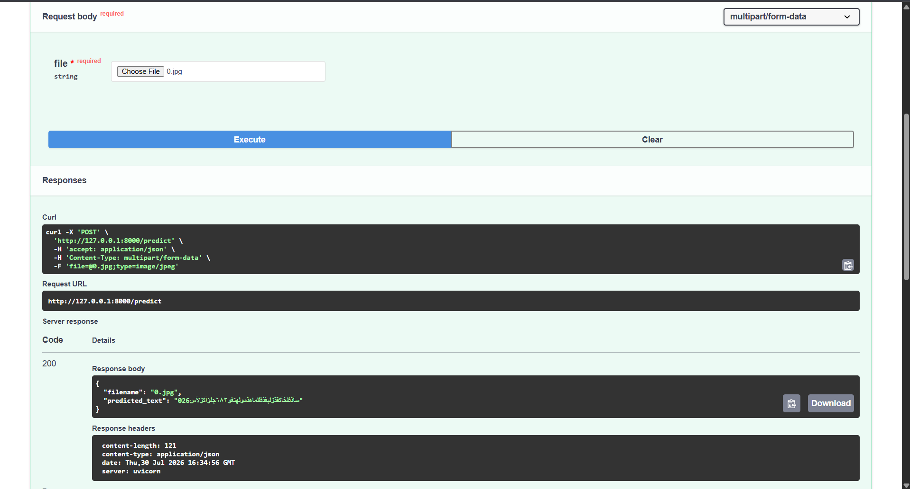

# Arabic OCR API

This project is an Arabic Optical Character Recognition (OCR) microservice built with **TensorFlow**, **FastAPI**, and a **CRNN + CTC** model. The API accepts an image containing Arabic text and returns the recognized text in JSON format.

## Requirements

- Python 3.10 or later
- pip

## Setup

### 1. Clone the repository

```bash
git clone https://github.com/mohamed-295/AI_CS_IEEE-ZSB-26.git
cd Task_20
```

### 2. Install dependencies

```bash
pip install -r requirements.txt
```

### 3. Download the OCR model

Download the trained model from the provided Google Drive link and place it in the weights folder:

https://drive.google.com/drive/folders/1yhlDlbLm7N1fjzlvHL1M3koFmh1NBWdj?usp=drive_link

```bash
# Example:
# place the downloaded file as:
# weights/best_ocr_model.keras
```

> The model file is not included in the repository, so you must download it manually before running the API.

## Run the API

Start the FastAPI server using Uvicorn:

```bash
uvicorn app.main:app --reload
```

The server will be available at:

```
http://127.0.0.1:8000
```

## API Documentation

Swagger UI is automatically generated by FastAPI and can be accessed at:

```
http://127.0.0.1:8000/docs
```

You can upload an image through the **/predict** endpoint to test the OCR model.

## Project Structure

```
app/
├── main.py          
├── model.py         # OCR model loading and inference
weights/
└── best_ocr_model.keras
requirements.txt
README.md
```

## Testing

1. Start the server:

```bash
uvicorn app.main:app --reload
```

2. Open Swagger UI:

```
http://127.0.0.1:8000/docs
```

3. Expand the **POST /predict** endpoint.

4. Upload an Arabic text image and click **Execute**.

5. The API returns a JSON response similar to:

```json
{
  "filename": "sample.png",
  "predicted_text": "الكلام اللي هيطلع"
}
```

## Swagger UI Screenshot

